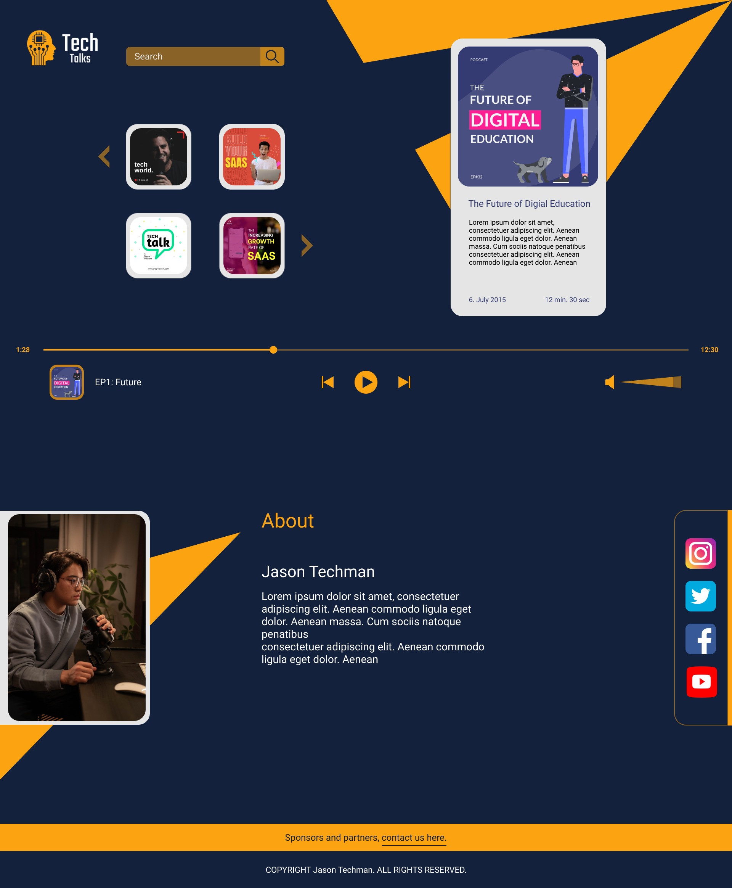
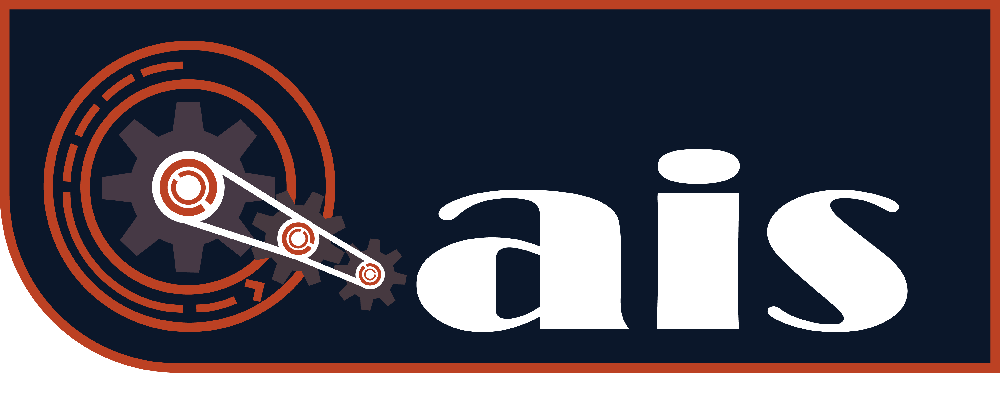
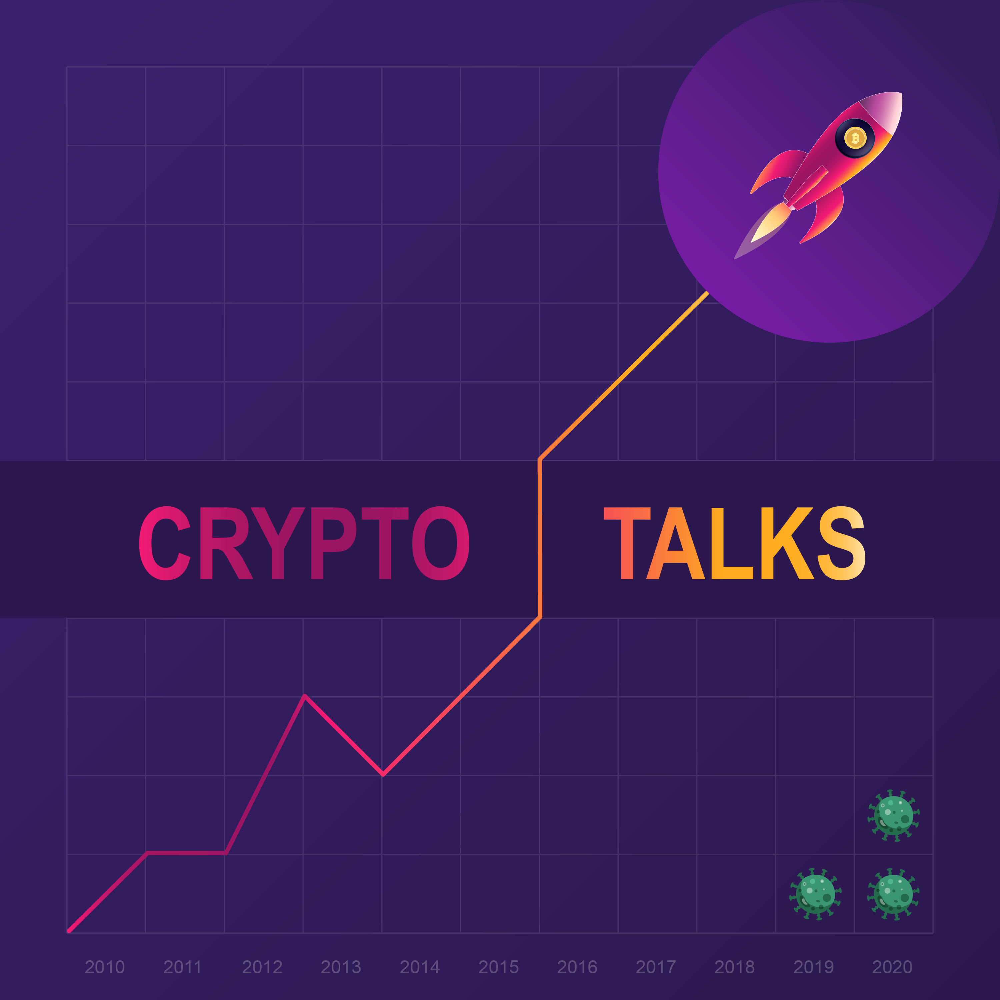

# UI/UX- & Grafik-Designs (ITA-Ausbildung)

Hallo! Dieses Repository enthaelt verschiedene Design-Arbeiten, die ich waehrend meiner Ausbildung zum Informationstechnischen Assistenten (ITA) erstellt habe.

---

## 1. Projekt: "Tech Talks" Podcast Website

**Projekt-Typ:** UI-Design & Implementierung
**Werkzeuge:** Figma, Illustrator (fuer das Design) / HTML, CSS, JS (fuer die Umsetzung)
**Kontext:** Eine Projektarbeit waehrend der ITA-Ausbildung.

Dies ist ein vollstaendiges, mehrteiliges Layout fuer eine fiktive Podcast-Website. Das Design umfasst einen globalen Player, eine Episoden-Liste, eine Suchfunktion und einen "About"-Bereich.

**Hinweis:** Das Design wurde von mir nach der Konzeption auch vollstaendig in HTML/CSS/JS implementiert. Dieses Repository zeigt jedoch nur den Design-Anteil (das Figma-Mockup).

---

## 2. Projekt: "qais" Persoenliches Logo

**Projekt-Typ:** Logo-Design / Branding
**Werkzeuge:** Figma, Illustrator
**Kontext:** Erstellt im Rahmen des ersten Website-Projekts waehrend der ITA-Ausbildung.

Das Ziel war die Erstellung eines persoenlichen Logos, das ein technisches Thema (Zahnraeder, Antrieb) mit meinem Namen kombiniert.

---

## 3. Projekt: "Crypto Talks" Podcast Cover

**Projekt-Typ:** Grafik / Cover-Design
**Werkzeuge:** Figma, Illustrator
**Kontext:** Eine Design-Uebung waehrend der ITA-Ausbildung.

Dies ist ein Cover-Artwork, das fuer einen fiktiven "Crypto Talks" Podcast entworfen wurde.

